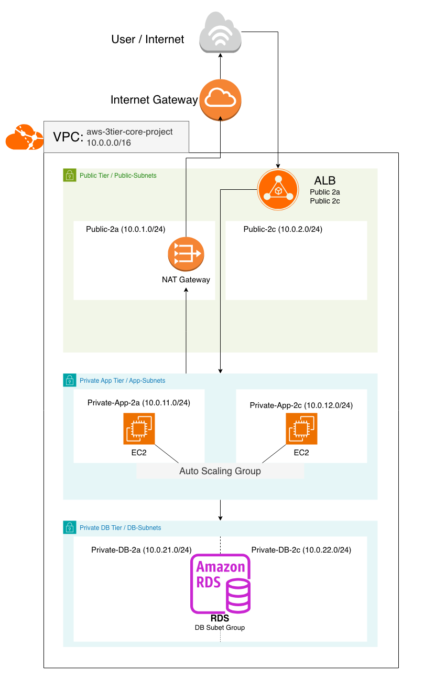

# AWS 3-Tier Core Project

## Overview
이 프로젝트는 클라우드 운영 / 시스템 엔지니어 취업 포트폴리오를 목표로 만든 AWS 기반 3-Tier 아키텍처 프로젝트입니다.

초기 단계에서는 AWS Console 기반으로 코어 아키텍처를 직접 구축했고,
이후 운영 고도화와 Terraform 코드화까지 확장하는 것을 목표로 합니다.

## Architecture Diagram

## Project Scope
### Phase 1. Core Build
- Public / Private 네트워크 분리
- ALB - App EC2 - RDS 구조
- NAT Gateway 기반 Private App Tier 아웃바운드 통신
- Launch Template + Auto Scaling Group
- Security Group 계층 분리
- 최소 CloudWatch Alarm 구성

### Phase 2. Operational Enhancements
- IAM Role and SSM Session Manager *(완료)*
- Launch Template Update and Instance Refresh *(planned)*
- CloudWatch Dashboard *(planned)*
- HTTPS, ACM, and Route 53 *(planned)*

### Phase 3. Infrastructure as Code
- Terraform *(planned)*

## Documentation

### Phase 1. Core Build
- [Core Build](docs/core-build.md)
- [Security Group Design](docs/security-group-design.md)
- [Troubleshooting](docs/troubleshooting.md)

### Phase 2. Operational Enhancements
- IAM Role and SSM Session Manager *(planned)*
- Launch Template Update and Instance Refresh *(planned)*
- CloudWatch Dashboard *(planned)*
- HTTPS, ACM, and Route 53 *(planned)*

### Phase 3. Infrastructure as Code
- Terraform *(planned)*

## Current Status
- AWS Console 기반 Core Build 문서화 완료
- Security Group 설계 문서화 완료
- Troubleshooting 문서화 완료
- 운영 고도화 및 Terraform 단계는 예정

## Why This Project
- 단순 EC2 1대 배포가 아니라 실무형 3-Tier 구조를 직접 설계하고 구현
- Public / Private 계층 분리와 보안 그룹 설계 경험 확보
- 이후 운영 개선과 IaC 전환까지 이어질 수 있는 기준선 프로젝트

## Future Improvements
- IAM Role / SSM Session Manager 적용
- Launch Template 버전 관리 및 Instance Refresh
- CloudWatch Dashboard 구성
- HTTPS + ACM + Route 53 연결
- Terraform 코드화
- 운영 자동화 구조 확장

## 최근 업데이트

- `core-build.md` 기준으로 AWS 3-Tier Core 아키텍처를 재구성했다.
- App 서버용 EC2 Launch Template에 IAM Role을 적용해 AWS Systems Manager 기반 운영 접근이 가능하도록 구성했다.
- 보안그룹에는 SSH 22 포트를 열지 않고, Private App Instance 접근은 AWS Systems Manager Session Manager로 구현했다.