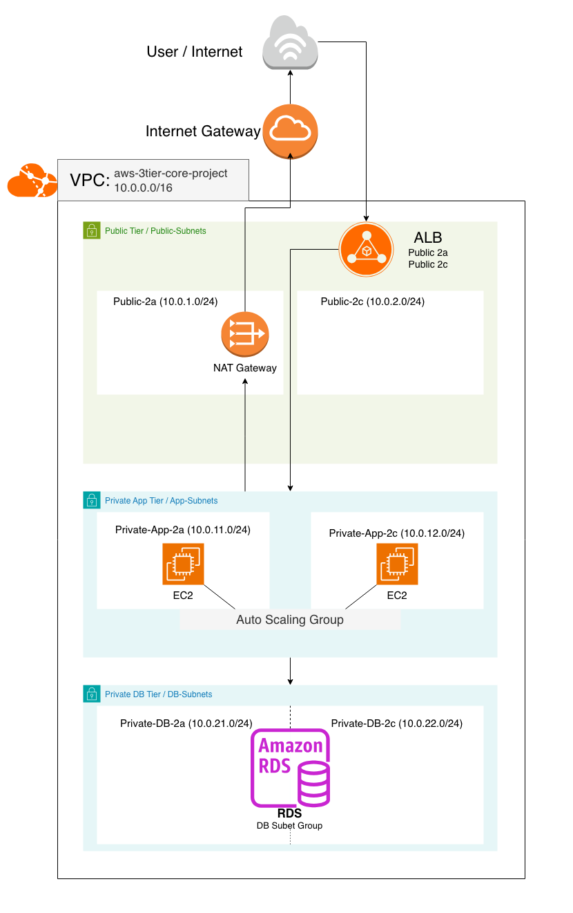

# AWS 3-Tier Core Project

## 프로젝트 개요
이 프로젝트는 클라우드 운영 / 시스템 엔지니어 취업 포트폴리오를 목표로 만든 AWS 기반 3-Tier 아키텍처 프로젝트입니다.

초기 단계에서는 AWS Console 기반으로 코어 아키텍처를 직접 구축했고,
이후 운영 고도화와 Terraform 코드화까지 확장하는 것을 목표로 합니다.

## 아키텍처 다이어그램

## 프로젝트 범위
### 1단계. 코어 구축
- Public / Private 네트워크 분리
- ALB - App EC2 - RDS 구조
- NAT Gateway 기반 Private App Tier 아웃바운드 통신
- Launch Template + Auto Scaling Group
- Security Group 계층 분리
- 최소 CloudWatch Alarm 구성

### 2단계. 운영 고도화
- IAM Role 등록 및 SSM Session Manager를 통한 접근
- Launch Template 수정 후 Instance Refresh를 통한 인스턴스 교체
- CloudWatch Dashboard 구성 완료
- HTTPS, ACM, Route 53을 활용한 외부 도메인 적용

### 3단계. Infrastructure as Code (IaC)
- Terraform 코드화 진행 중

## 문서

### 1단계. 코어 구축
- [코어 구축](docs/core-build.md)
- [보안 그룹 설계](docs/security-group-design.md)
- [트러블슈팅](docs/troubleshooting.md)

### 2단계. 운영 고도화
- [IAM Role 및 SSM Session Manager](docs/iam-role-ssm-session-manager.md)
- [Launch Template 수정 및 Instance Refresh](docs/launch-template-instance-refresh.md)
- [CloudWatch Dashboard](docs/cloudwatch-dashboard.md)
- [HTTPS, ACM, Route 53](docs/https-acm-route53.md)

### 3단계. Infrastructure as Code (IaC)
- [Terraform](https://github.com/soosung476/aws-3tier-terraform)

## 현재 진행 상태
- AWS Console 기반 Core Build 문서화 완료
- Security Group 설계 문서화 완료
- IAM Role, SSM Session Manager 문서화 완료
- Launch Template, Instance Refresh 문서화 완료
- CloudWatch Dashboard 구성 및 문서화 완료
- HTTPS + ACM + Route 53 실제 도메인 연결 및 문서화 완료
- Troubleshooting 문서화 완료
- Terraform 코드는 별도 Repository에서 진행 중

## 이 프로젝트를 진행한 이유
- 단순 EC2 1대 배포가 아니라 실무형 3-Tier 구조를 직접 설계하고 구현
- Public / Private 계층 분리와 보안 그룹 설계 경험 확보
- 이후 운영 개선과 IaC 전환까지 이어질 수 있는 기준선 프로젝트

## 향후 개선 계획
- 운영 자동화 구조 확장

## 최근 업데이트

- CloudWatch Dashboard 구성 및 실습 완료
- 외부 도메인 구매 후 HTTPS + ACM + Route 53 실습 완료
- Terraform 작업용 별도 Repository 연결
