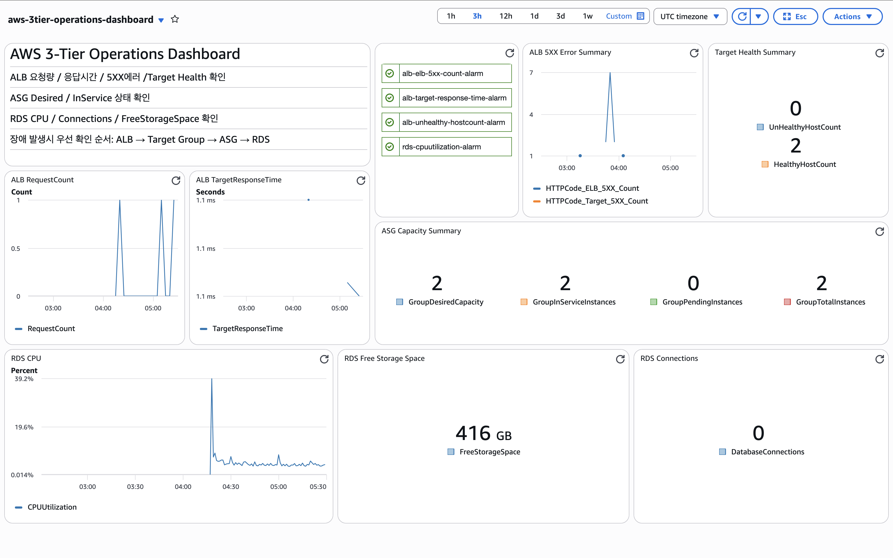

# CloudWatch Dashboard 구성

## 1. 개요

이번 단계에서는 기존 AWS 3-Tier Core 환경에 CloudWatch Dashboard를 구성해  
ALB, Auto Scaling Group, RDS 상태를 한 화면에서 확인할 수 있도록 정리했다.

이 단계의 목적은 단순히 리소스를 구축하는 것이 아니라,  
운영 관점에서 현재 서비스 상태를 빠르게 확인할 수 있는 모니터링 화면을 만드는 것이었다.

---

## 2. 이번 단계에서 진행한 내용

이번 단계에서는 아래 작업을 진행했다.

- CloudWatch Dashboard 생성
- ALB / ASG / RDS 주요 메트릭 위젯 구성
- Alarm status widget 추가
- Custom Alarm 4개 생성 및 대시보드 연결

최종적으로 요청 흐름, 응답 지연, 5XX 오류, Target Health, ASG 상태, RDS 상태를  
한 화면에서 확인할 수 있는 운영용 대시보드를 구성했다.

---

## 3. Dashboard 구성과 진행과정

### 3-1. Dashboard 이름

- `aws-3tier-operations-dashboard`

### 3-2. Text widget

대시보드 상단에는 아래 내용을 정리한 Text widget을 추가했다.

- ALB 요청량 / 응답시간 / 5XX 에러 / Target Health 확인
- ASG Desired / InService 상태 확인
- RDS CPU / Connections / FreeStorageSpace 확인
- 장애 발생 시 확인 순서: ALB → Target Group → ASG → RDS

### 3-3. ALB 위젯

ALB 구간에는 아래 위젯을 배치했다.

- `ALB Request Count`
- `ALB Target Response Time`
- `ALB 5XX Error Summary`
- `Target Health Summary`

이를 통해 요청 수, 응답 지연, 5XX 오류, 타겟 상태를 확인할 수 있도록 구성했다.

### 3-4. ASG 위젯

ASG는 처음에는 line graph로 구성했지만,  
`Desired`, `InService`, `Total` 값이 자주 겹쳐 시각적으로 구분이 어려웠다.

그래서 최종적으로는 Number widget으로 변경해  
현재 상태를 직관적으로 확인할 수 있도록 아래처럼 구성했다.

- `ASG Capacity Summary`

표시 항목:

- `GroupDesiredCapacity`
- `GroupInServiceInstances`
- `GroupPendingInstances`
- `GroupTotalInstances`

### 3-5. RDS 위젯

RDS는 아래처럼 구성했다.

- `RDS CPU` → Line graph
- `RDS Free Storage Space` → Number widget
- `RDS Connections` → Number widget

CPU는 추세 확인이 중요해 line graph로 유지했고,  
Free Storage Space와 Connections는 현재 값 확인이 중요해 Number widget으로 정리했다.

### 3-6. Alarm status widget

대시보드 상단에는 Alarm status widget을 추가해  
현재 주요 알람 상태를 바로 확인할 수 있도록 구성했다.

적용한 알람:

- `alb-elb-5xx-count-alarm`
- `alb-target-response-time-alarm`
- `alb-unhealthy-hostcount-alarm`
- `rds-cpuutilization-alarm`

---

## 4. Custom Alarm 구성

이번 단계에서는 운영 관점에서 의미 있는 커스텀 알람 4개를 추가했다.

### 4-1. alb-elb-5xx-count-alarm

ALB 자체에서 발생하는 5XX 오류를 감지하기 위한 알람이다.  
로드 밸런서 계층에서 서버 오류가 발생하는지 확인하는 용도로 사용했다.

### 4-2. alb-target-response-time-alarm

Target Response Time이 일정 기준 이상으로 증가하는 경우를 감지하기 위한 알람이다.  
즉시 장애가 발생하지 않더라도, 응답 지연이 커지는 초기 징후를 확인하기 위해 구성했다.

### 4-3. alb-unhealthy-hostcount-alarm

Target Group 내 인스턴스가 Health Check에 실패해  
실제로 트래픽을 받을 수 없는 상태가 되었는지 감지하기 위한 알람이다.

### 4-4. rds-cpuutilization-alarm

RDS CPU 사용률이 높아지는 상황을 감지하기 위한 알람이다.  
ALB 응답 지연이 발생할 때 DB 병목 여부를 함께 확인하기 위해 구성했다.

---

## 5. 이번 단계에서 확인한 점

이번 작업을 통해 단순히 메트릭을 많이 넣는 것보다,  
운영 중 빠르게 판단할 수 있도록 위젯을 정리하는 것이 더 중요하다는 점을 확인했다.

특히 아래 부분이 의미 있었다.

- ALB 5XX 오류와 Target Health를 분리해서 볼 수 있었음
- ASG 상태는 line graph보다 Number widget이 더 직관적이었음
- RDS 메트릭은 모두 시계열 그래프로 둘 필요는 없었음
- Alarm status widget을 통해 주요 알람 상태를 한눈에 볼 수 있었음

즉, 이번 단계는 기존 Core Build 위에  
운영 관찰성과 모니터링 경험을 추가한 단계라고 정리할 수 있다.

---

## 6. 스크린샷

