# Core Build

이 문서는 AWS Console 기반으로 AWS 3-Tier Core Architecture를 구축한 과정을 정리한 문서입니다.

범위:
- VPC / Subnet / Route Table / IGW / NAT Gateway
- ALB / Target Group / Launch Template / Auto Scaling Group
- EC2 App Tier / RDS MySQL / Security Group
- 최소 CloudWatch Alarm

이후 운영 고도화(SSM, HTTPS, Dashboard, Terraform)는 별도 문서로 분리하여 관리합니다.

## Step 1. VPC 생성
- VPC 이름: aws-3tier-core-project
- IPv4 CIDR: 10.0.0.0/16
- DNS resolution: Enabled

---

---

## Step 2. 서브넷 6개 생성
3-Tier 아키텍처 구성을 위해 아래와 같이 총 6개의 서브넷을 생성했다.

- Public-2a: 10.0.1.0/24
- Public-2c: 10.0.2.0/24
- Private-App-2a: 10.0.11.0/24
- Private-App-2c: 10.0.12.0/24
- Private-DB-2a: 10.0.21.0/24
- Private-DB-2c: 10.0.22.0/24

Public / App / DB 계층을 분리하고, 2개 AZ에 걸쳐 배치할 수 있도록 설계했다.

---
## Step 3. Internet Gateway 생성 및 VPC 연결
인터넷에서 ALB로 들어오는 트래픽을 처리할 수 있도록 Internet Gateway를 생성하고 VPC에 연결했다.

- IGW 이름: 3tier-core-IGW
- 연결 대상 VPC: aws-3tier-core-project
- 상태: Attached

---

## Step 4. NAT Gateway 생성
Private App Subnet의 EC2 인스턴스가 외부 인터넷으로 아웃바운드 통신을 할 수 있도록 NAT Gateway를 생성했다.

- NAT 이름: 3tier-core-NAT
- 배치 서브넷: Public-2a
- Connectivity type: Public
- Elastic IP 연결 완료
- 상태: Available

---

## Step 5. Route Table 구성
퍼블릭 프라이빗 네트워크를 분리하기 위해서 Route Table을 3개 생성하고, 각 Subnet을 목적에 맞는 Route Table에 연결하였다.

### 1) Public Route Table
- 목적: 인터넷과 직접 통신하는 퍼블릭 계층용
- 라우트:
  - `10.0.0.0/16 -> local`
  - `0.0.0.0/0 -> Internet Gateway`
- 연결 서브넷:
  - Public-2a
  - Public-2c

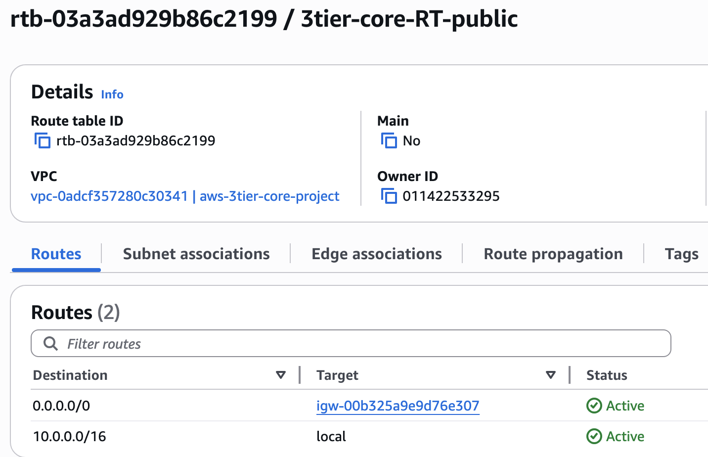
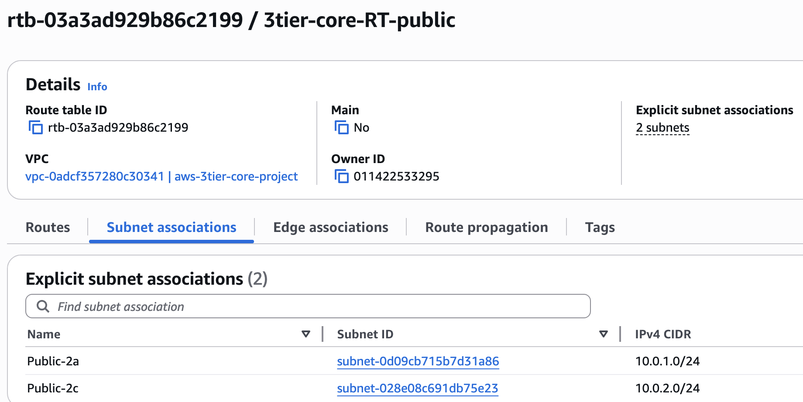

### 2) Private App Route Table
- 목적: 프라이빗 App EC2의 아웃바운드 인터넷 통신용
- 라우트:
  - `10.0.0.0/16 -> local`
  - `0.0.0.0/0 -> NAT Gateway`
- 연결 서브넷:
  - Private-App-2a
  - Private-App-2c

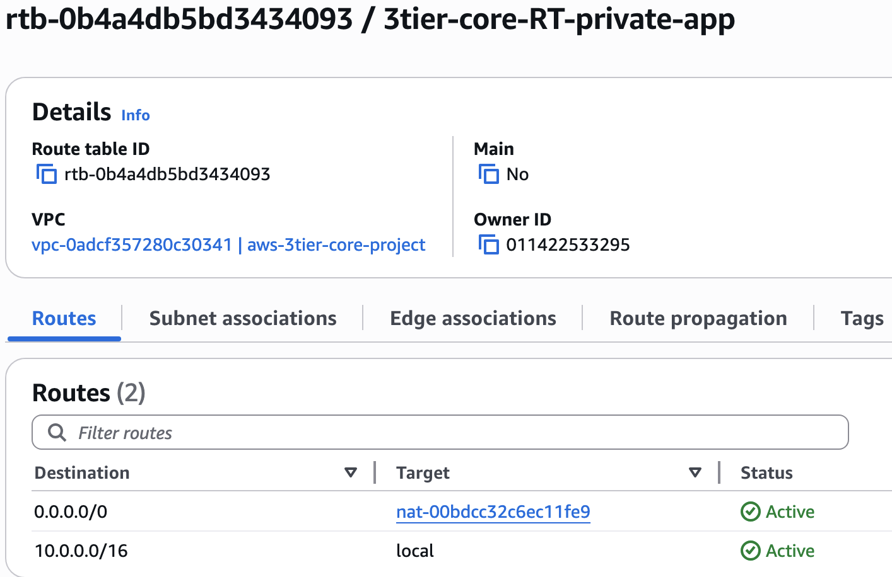
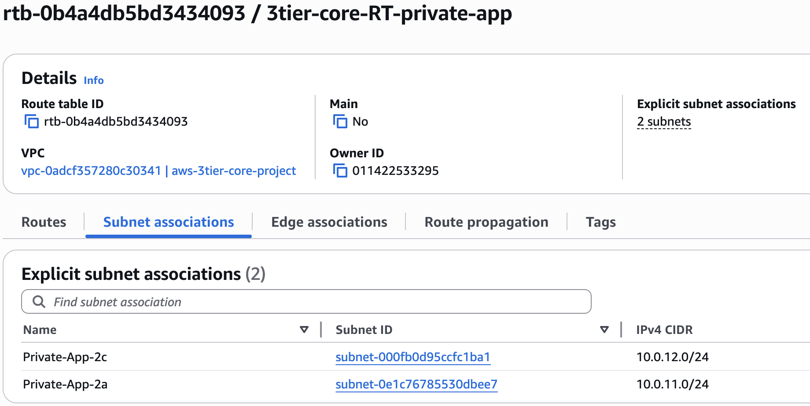

### 03) Private DB Route Table
- 목적: DB 계층 격리용
- 라우트:
  - `10.0.0.0/16 -> local`
- 연결 서브넷:
  - Private-DB-2a
  - Private-DB-2c

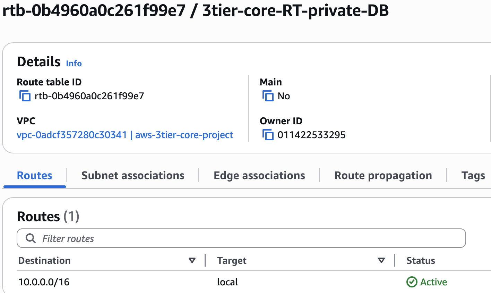
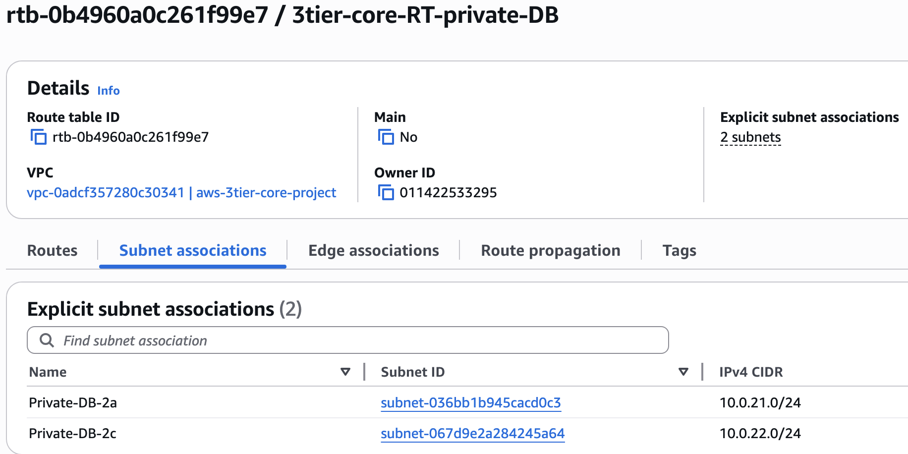

---

## Step 6. Security Group 설계 및 생성

계층별 접근 범위를 제한하기 위해 ALB, App, DB 각각에 대해 별도의 Security Group을 생성했다.

### 1) ALB Security Group
- 이름: `3tier-core-SG-ALB`
- 목적: 인터넷에서 들어오는 HTTP 요청 수신
- Inbound:
  - HTTP 80 from `0.0.0.0/0`
- Outbound:
  - 기본 전체 허용

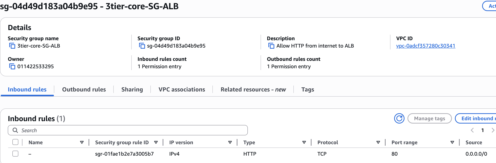
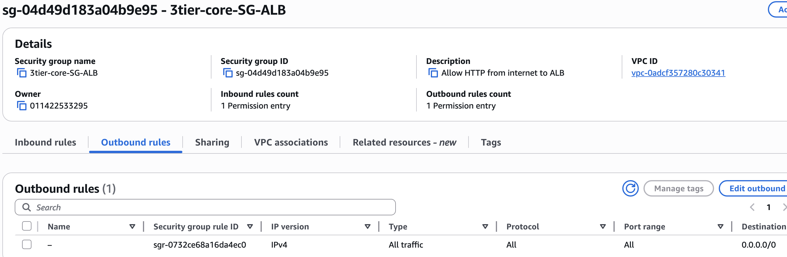

### 2) App Security Group
- 이름: `3tier-core-SG-App`
- 목적: ALB에서 들어오는 HTTP 요청만 수신
- Inbound:
  - HTTP 80 from `3tier-core-SG-ALB`
- Outbound:
  - 기본 전체 허용

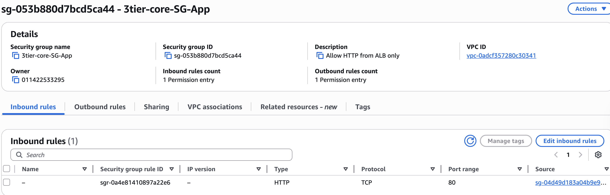  
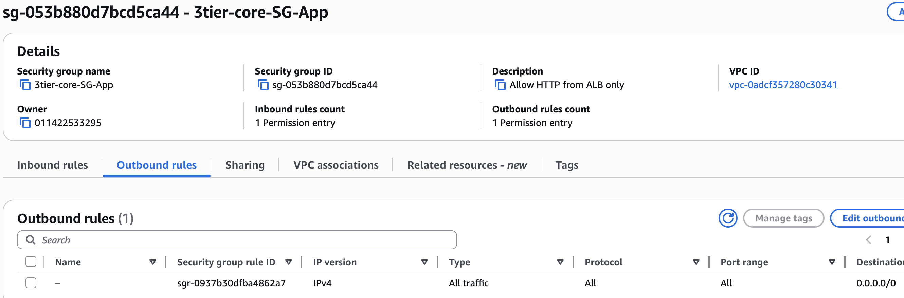  

### 3) DB Security Group
- 이름: `3tier-core-SG-DB`
- 목적: App계층에서 들어오는 MySql요청만 수신
- Inbound:
  - MySql 3306 from `3tier-core-SG-App`
- Outbound:
  - 기본 전체 허용

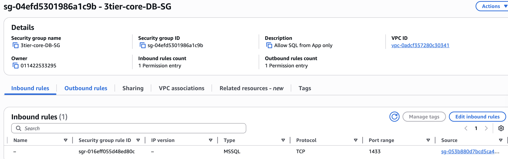  
  

---

## Step 7. DB Subnet Group 생성
Private DB Subnet 2개를 묶어 DB Subnet Group을 생성했다.

- Name: `tier3-core-db-subnet-group`
- VPC: `aws-3tier-core-project`
- Subnets:
  - Private-DB-2a
  - Private-DB-2c

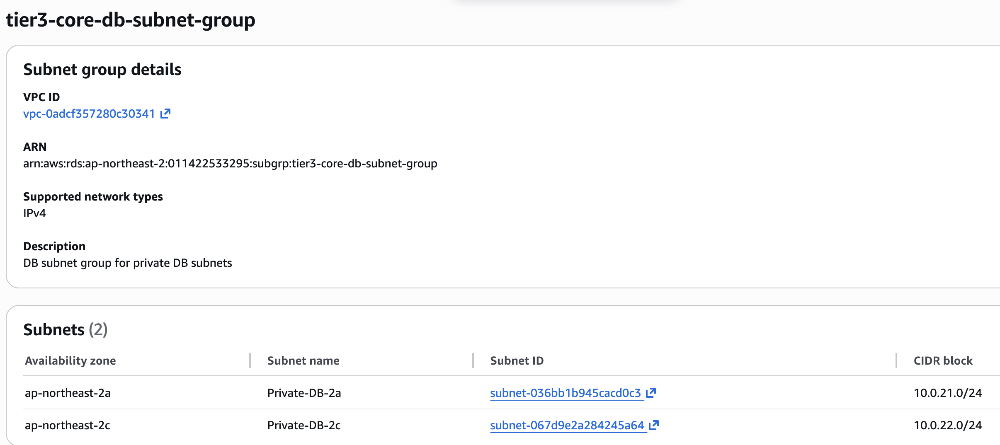

---

## Step 8. RDS 생성
MySQL 기반 RDS 인스턴스를 생성했다.

- DB identifier: `tier3-core-mysql`
- Engine: MySQL
- VPC: `aws-3tier-core-project`
- DB subnet group: `tier3-core-db-subnet-group`
- Public access: No
- Security group: `3tier-core-SG-DB`

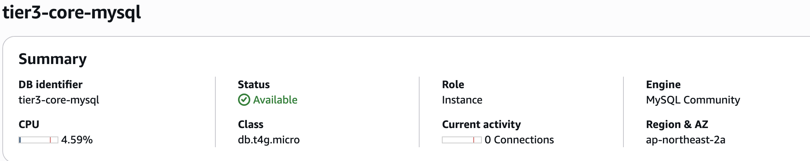
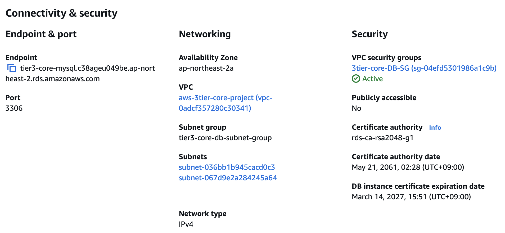

---

## Step 9. Launch Template 생성
Auto Scaling Group이 Private App Subnet에 EC2 인스턴스를 자동 생성할 수 있도록 Launch Template을 생성했다.

- Launch template name: `3tier-core-lt-app`
- Instance type: `t3.micro`
- AMI: Amazon Linux
- User data: nginx 설치 및 기본 페이지 생성 스크립트 적용

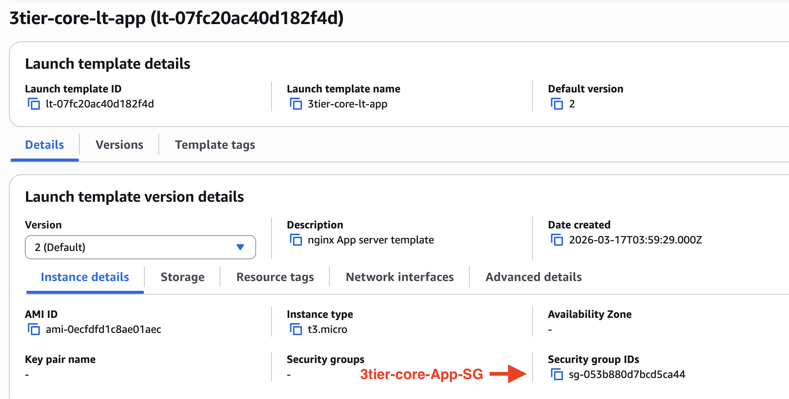
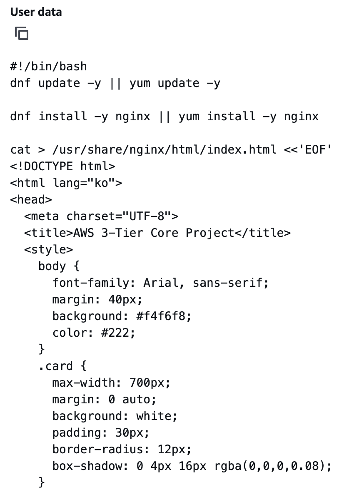

---

## Step 10. Target Group 생성
ALB와 EC 사이를 연결하기 위해서 Target Group을 생성했다.

- Target group name: `3tier-core-TG-app`
- Target type: `Instance`
- VPC: `aws-3tier-core-project`
- Health check: 
  - Protocol: `HTTP`
  - Path: `/`
  - Success code: `200`

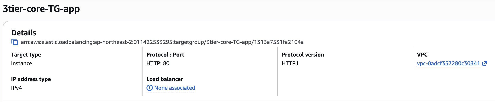
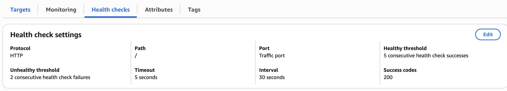

---

## Step 11. ALB 생성
인터넷에서 들어오는 요청을 수신하고, 이를 Target Group에 전달한 뒤 Healthy 상태의 App EC2로 분산하기 위해 ALB를 생성했다.

- ALB name: `3tier-core-ALB`
- Scheme: `Internet-facing`
- VPC: `aws-3tier-core-project`
- Subnets: `Public-2a`, `Public-2c`
- SG: `3tier-core-SG-ALB`
- Default action: `3tier-core-TG-app`

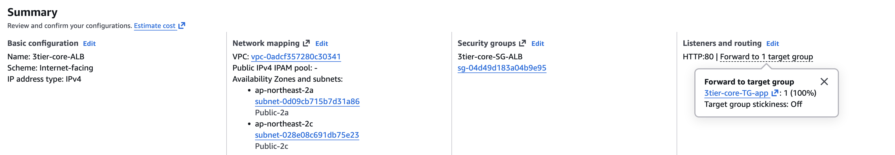
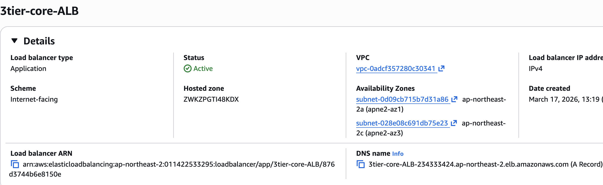
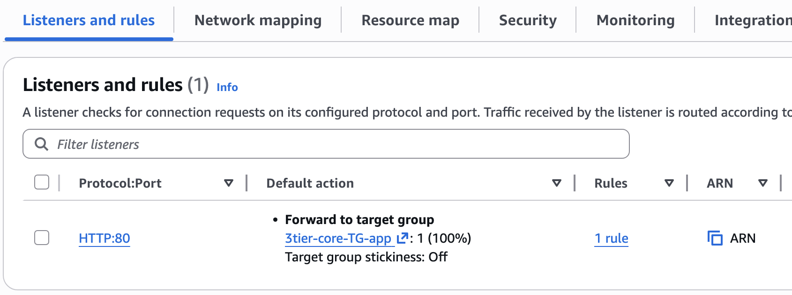

---

## Step 12. ASG 생성
Launch Template을 기반으로 App EC2를 자동 생성·관리하고, 필요 시 확장/축소할 수 있도록 Auto Scaling Group을 생성했다.

- ASG Name: `3tier-core-ASG-app`
- Launch Template: `3tier-core-lt-app`
- VPC: `aws-3tier-core-project`
- Subnets: `Private-App-2a`, `Private-App-2c`
- Target Group: `3tier-core-TG-App`
- Desired =2
- Min = 2
- Max = 4
- Health Check: `EC2 + ELB Health Check`

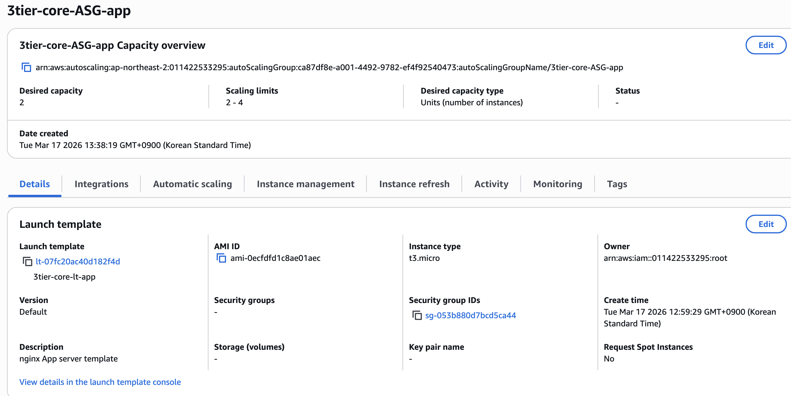
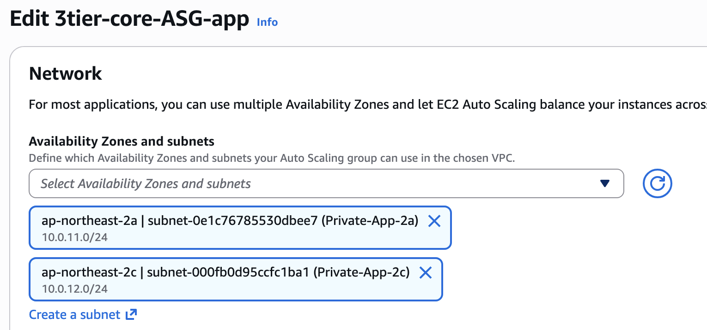

---

## Step 13. CloudWatch 최소 알람 생성

운영 상태를 최소 수준으로 모니터링하기 위해 CloudWatch 알람을 생성했다.
생성한 알람은 다음과 같다.

### 1) App EC2 CPU 높음
- Alarm name:
  - `tier3-app-ec2-cpu-high-1`
  - `tier3-app-ec2-cpu-high-2`
- Metric: `CPUUtilization`
- Statistic: `Average`
- Period: `5 minutes`
- Condition: `> 70`
- Datapoints to alarm: `2 out of 2`

### 2) ALB HealthyHostCount 낮음
- Alarm name: `tier3-alb-healthy-host-count-low`
- Metric: `HealthyHostCount`
- Statistic: `Minimum`
- Condition: `<= 1`
- Datapoints to alarm: `2 out of 2`

### 3) RDS CPU 높음
- Alarm name: `tier3-rds-cpu-high`
- Metric: `CPUUtilization`
- Statistic: `Average`
- Period: `5 minutes`
- Condition: `>= 70`
- Datapoints to alarm: `2 out of 2`

### 4) RDS FreeStorageSpace 낮음
- Alarm name: `tier3-rds-free-storage-low`
- Metric: `FreeStorageSpace`
- Statistic: `Average`
- Condition: `<= 2147483648` (2GB)
- Datapoints to alarm: `2 out of 2`

이번 코어 프로젝트에서는 SNS 이메일 알림은 연결하지 않고, 콘솔에서 알람 상태를 확인하는 방식으로 구성했다.

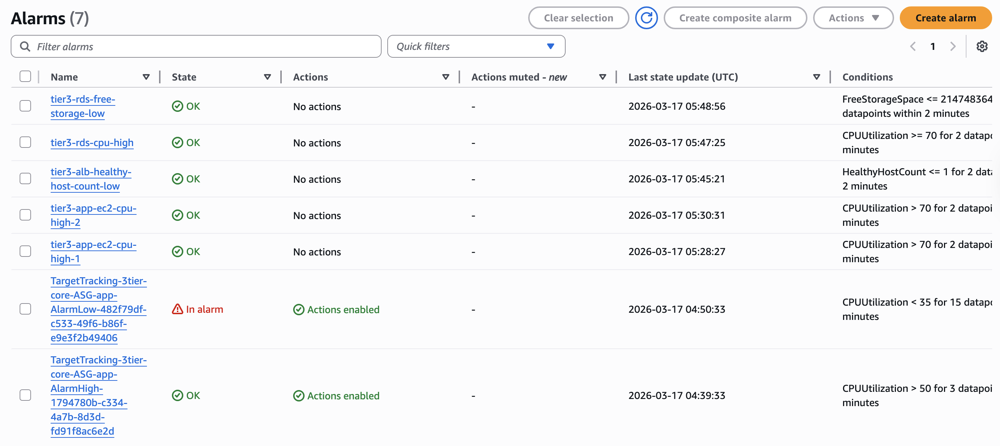

## Step 14. 동작 검증

구성한 3-Tier 아키텍처가 정상적으로 동작하는지 아래 항목을 기준으로 검증했다.

- Auto Scaling Group이 Private App Subnet 2개에 EC2 인스턴스 2대를 생성함
- 생성된 인스턴스가 모두 `InService`, `Healthy` 상태로 표시됨
- Target Group에서 healthy target 2개를 확인함
- ALB DNS 주소로 접속 시 nginx 기반 테스트 페이지가 정상 출력됨
- App 계층은 Private Subnet에 위치하고, 인터넷 요청은 ALB를 통해서만 전달되는 구조를 확인함

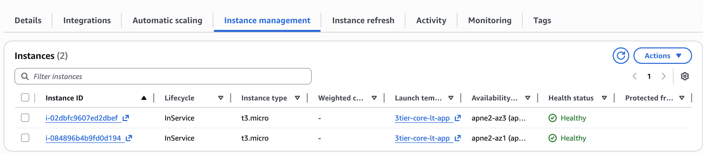
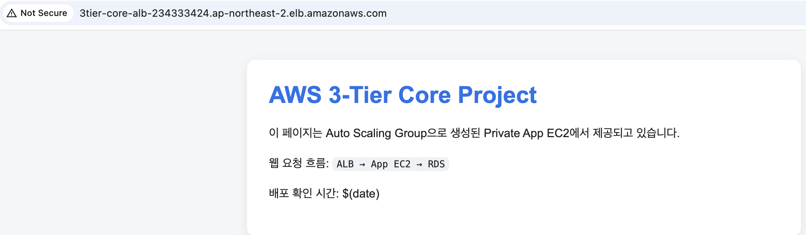