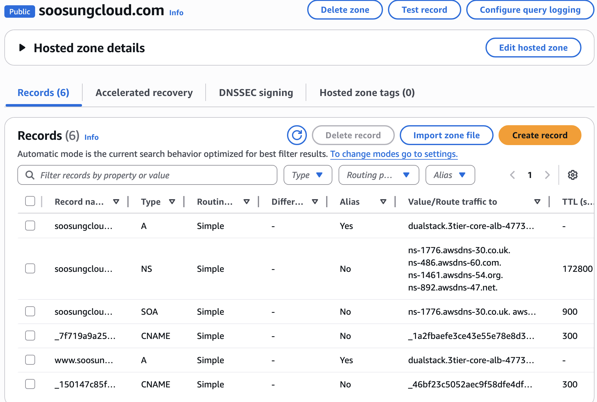
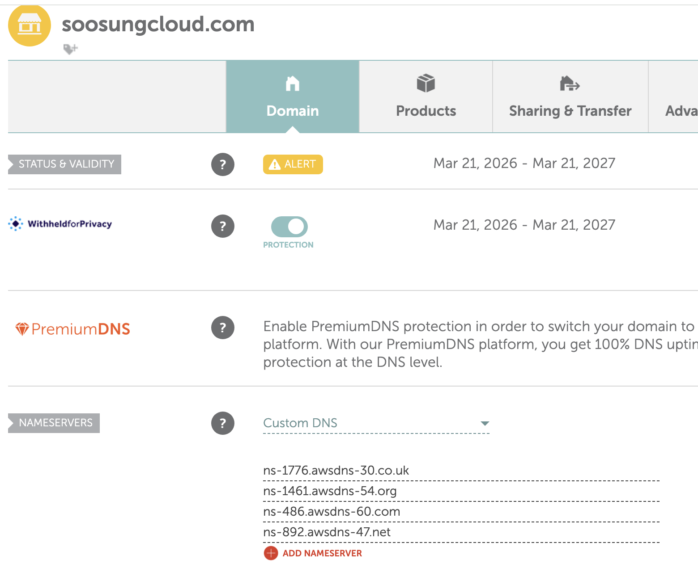
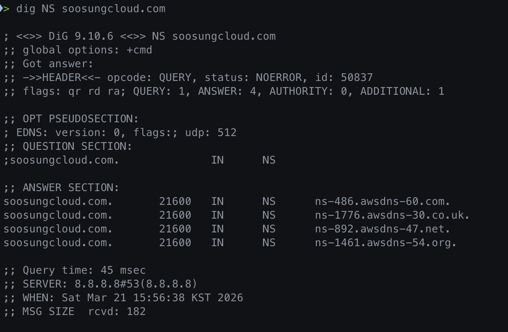
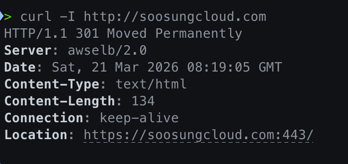
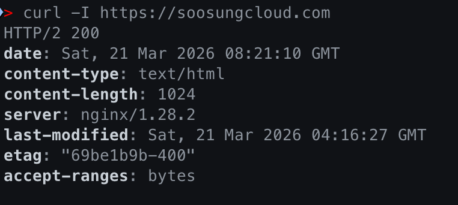
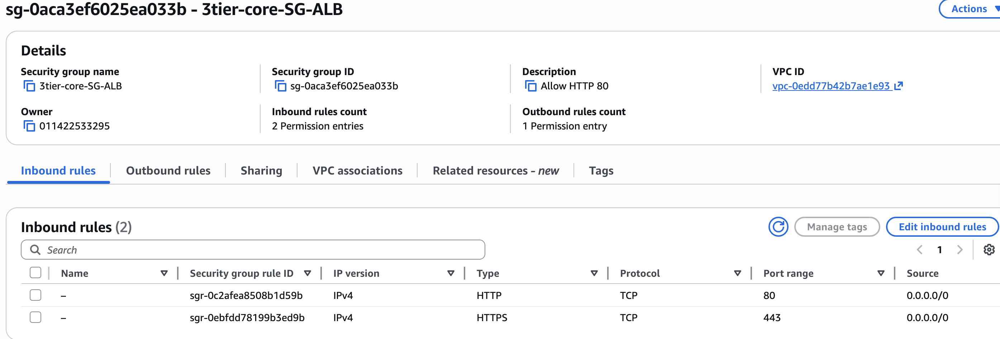
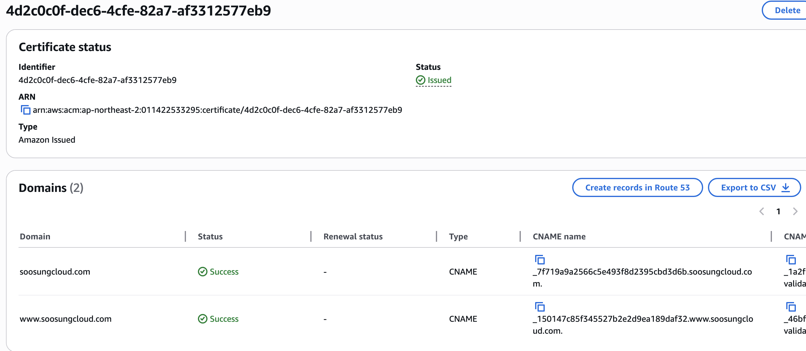
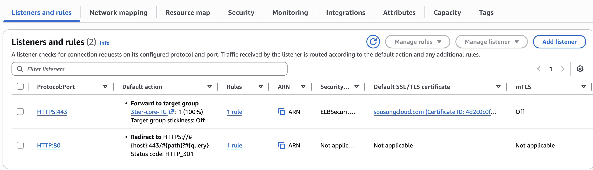
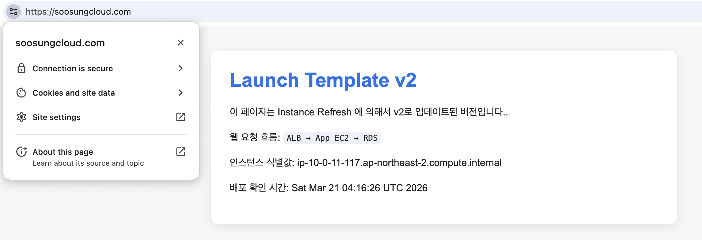

# HTTPS + ACM + Route 53

## Overview
이번 단계에서는 기존 AWS 3-Tier Project에  
**도메인 연결과 HTTPS 적용** 을 추가했다.

이전 단계에서 ALB, Auto Scaling Group, RDS, IAM Role + SSM Session Manager,  
Launch Template Update + Instance Refresh, CloudWatch Dashboard 구성을 완료했고,  
이번에는 운영 관점에서 외부 사용자가 실제 서비스처럼 접근할 수 있도록 다음을 구성했다.

- 외부 등록업체에서 구매한 도메인을 Route 53에 연결
- ACM Public Certificate 발급
- ALB에 HTTPS(443) Listener 적용
- HTTP(80) → HTTPS(443) Redirect 설정

최종적으로 사용자는 아래와 같이 접속할 수 있게 되었다.

- `http://soosungcloud.com` → `https://soosungcloud.com`
- `https://soosungcloud.com` 직접 접속 가능

---

## 이번 단계가 중요한 이유
이번 단계는 단순히 웹 페이지를 띄우는 수준을 넘어서,  
**실제 운영 서비스 형태에 가까운 접근 구조를 만드는 과정** 이다.

기존에는 ALB DNS 주소로만 접근할 수 있었지만,  
이번 작업을 통해 다음과 같은 개선이 이루어졌다.

- 사용자가 기억하기 쉬운 **도메인 기반 접근**
- 암호화된 통신을 위한 **HTTPS 적용**
- ALB를 통한 **일관된 진입점 구성**
- 포트폴리오 관점에서 더 실제 서비스에 가까운 아키텍처 완성

즉, 이번 단계는  
**"기능이 동작하는 인프라"를 "운영 가능한 서비스 형태"로 발전시키는 과정** 이라고 볼 수 있다.

---

## 아키텍쳐 흐름
전체 연결 흐름은 아래와 같다.

`User Browser -> DNS Query -> Route 53 -> ALB(HTTPS 443) -> Target Group -> App EC2 -> RDS`

동작 방식은 다음과 같다.

1. 사용자가 `soosungcloud.com` 으로 접속한다.
2. DNS 질의는 Route 53 Hosted Zone으로 전달된다.
3. Route 53 Alias Record가 도메인을 ALB로 연결한다.
4. ALB는 443 Listener에서 ACM 인증서를 사용해 HTTPS 연결을 처리한다.
5. ALB는 요청을 Target Group으로 전달한다.
6. App EC2가 요청을 처리한다.

---

## 개념정리

이번 단계에서는 외부에서 구매한 도메인을 Route 53에 연결하고, ACM 인증서를 이용해 ALB에 HTTPS를 적용했다.  
실습 과정에서 사용한 주요 개념은 아래와 같다.

### 1. NS Record
NS(Name Server) 레코드는  
**"이 도메인의 DNS 정보를 어떤 네임서버가 관리하는가"** 를 알려주는 레코드이다.

이번 실습에서는 외부 도메인 등록업체에서 구매한 도메인의 네임서버를  
Route 53 Hosted Zone이 제공한 NS 값 4개로 변경했다.

이는 도메인의 DNS 권한을 Route 53으로 위임한 것 이다.

### 2. SOA Record
SOA(Start of Authority) 레코드는  
**해당 DNS Zone의 기본 메타데이터를 담고 있는 레코드** 이다.

여기에는 보통 다음과 같은 정보가 포함된다.

- 대표 네임서버
- 관리 주체 정보
- serial number
- refresh / retry / expire 값

즉, SOA는  
**"이 Zone이 어떤 기준으로 관리되는지"** 를 나타내는 관리용 레코드라고 이해하면 된다.

### 3. ACM Public Certificate
ACM(AWS Certificate Manager) Public Certificate는  
**도메인에 HTTPS를 적용하기 위한 공개 인증서** 이다.

이번 프로젝트에서는 EC2 인스턴스에 직접 인증서를 넣은 것이 아니라,  
**ALB의 HTTPS(443) Listener에 인증서를 연결** 했다.

즉, 사용자가 `https://domain` 으로 접속하면  
ALB가 인증서를 제시하고 TLS/SSL 연결을 종료한 뒤,  
그 요청을 Target Group의 App 서버로 전달하는 구조이다.

### 4. DNS Validation
DNS Validation은  
**"이 도메인을 실제로 내가 제어하고 있다"** 는 사실을 증명하는 방법이다.

ACM은 인증서를 발급하기 전에  
특정 CNAME 레코드를 DNS에 추가하도록 요구한다.

이번 실습에서는 Route 53 Hosted Zone에  
ACM이 제공한 검증용 CNAME 레코드를 추가했고,  
이를 통해 도메인 소유/제어 권한이 확인되면서 인증서가 발급되었다.

즉, DNS Validation은  
**인증서 발급 전 도메인 제어 권한을 확인하는 절차** 이다.

### 5. Alias Record
Alias Record는  
Route 53에서 AWS 리소스를 연결할 때 사용하는 레코드이다.

이번 실습에서는  
루트 도메인과 `www` 서브도메인을  
**ALB로 연결하기 위해 A - Alias Record** 를 사용했다.

Alias Record는  
**루트 도메인(example.com)에도 사용할 수 있고**,  
AWS 리소스(ALB, CloudFront 등)에 자연스럽게 연결할 수 있다.

즉, 이번 프로젝트에서 Alias Record의 역할은  
**도메인 요청을 ALB로 전달하는 것** 이다.

### 6. A Record / AAAA Record
A 레코드는 도메인을 **IPv4 주소** 로 연결하는 레코드이고,  
AAAA 레코드는 도메인을 **IPv6 주소** 로 연결하는 레코드이다.

- A = IPv4
- AAAA = IPv6

이번 실습에서는 ALB를 대상으로 Route 53 Alias를 사용했기 때문에,  
직접 IP를 입력하지는 않았지만  
개념적으로는 사용자가 도메인을 조회했을 때  
최종적으로 IPv4/IPv6 주소로 연결되도록 돕는 역할을 한다.

---

## 사전 구성 및 진행과정
이번 단계를 진행하기 전에 아래 조건이 충족되어 있어야 한다.

- 기존 3-Tier Architecture가 이미 구성되어 있을 것
- ALB와 Target Group이 정상 동작 중일 것
- App EC2가 정상적으로 서비스 응답을 반환할 것
- 외부 도메인 등록업체에서 도메인을 구매했을 것
- Route 53 Hosted Zone을 생성할 수 있는 상태일 것

---

## Step 1. 외부 도매인 구매
이번 실습에서는 Route 53에서 직접 도메인을 구매하지 않고,  
외부 등록업체에서 도메인을 구매했다 (namecheap 사이트를 이용).

이후 해당 도메인을 Route 53과 연결하는 방식으로 진행했다.

핵심 포인트는 다음과 같다.

- 도메인 구매는 외부 등록업체에서 수행
- DNS 관리는 Route 53 Hosted Zone에서 수행
- 외부 등록업체의 Nameserver 값을 Route 53 NS 값으로 변경

---

## Step 2. Route 53에 Public Hosted Zone 생성
AWS Console에서 Route 53 Hosted Zone을 생성했다.

- Route 53 → Hosted zones
- Create hosted zone
- Domain name 입력(soosungcloud.com)
- Type: Public hosted zone

생성 후 기본적으로 아래 레코드가 자동 생성된다.

- NS Record
- SOA Record

이 Hosted Zone이 앞으로 해당 도메인의 DNS 정보를 관리하는 공간이 된다.

---

## Step 3. 외부 등록업체의 네임서버 변경
외부 등록업체의 도메인 관리 화면에서  
기존 네임서버를 Route 53 Hosted Zone이 제공한 NS 4개 값으로 변경했다.

이 작업의 의미는 다음과 같다.

- 도메인의 DNS 권한을 Route 53으로 넘김
- 이후 Route 53의 레코드 설정이 실제 인터넷 DNS 응답에 반영됨

즉, Route 53이 authoritative DNS(최종답변자) 역할을 수행하게 된다.

---

## Step 4. ACM Public Certificate 요청
HTTPS 적용을 위해 ACM에서 Public Certificate를 요청했다.

- AWS Certificate Manager 이동
- Request a certificate
- Request a public certificate 선택
- Domain names:
  - `soosungcloud.com`
  - `www.soosungcloud.com`
- Validation method: DNS validation

이번 프로젝트에서는 HTTPS 인증서를 ALB에 연결하기 위해 ACM을 사용 했다.

---

## Step 5. DNS Validation
ACM은 인증서를 발급하기 전에  
도메인 제어 권한을 확인하기 위해 검증용 CNAME 레코드를 제공한다.

이번 실습에서는 해당 CNAME 레코드를 Route 53 Hosted Zone에 추가했다.

이후 상태가 아래처럼 변경되었다.

- Pending validation
- Issued

즉, Route 53 DNS 레코드를 통해  
도메인 통제 권한이 확인되면서 인증서가 발급되었다.

---

## Step 6. ALB Security Group 재설정
ALB Security Group에서 HTTPS 트래픽을 허용하도록 설정했다.

인바운드 허용 포트:

- 80
- 443

의미는 다음과 같다.

- 80: 기존 HTTP 요청 수신
- 443: 최종 HTTPS 서비스 요청 수신

---

## Step 7. ALB에 HTTPS Listener 추가
기존 ALB에 HTTPS Listener를 추가했다.

- Load Balancer: existing ALB
- Protocol: HTTPS
- Port: 443
- Default action: Forward to existing Target Group
- Certificate: ACM Public Certificate 선택

이렇게 구성함으로써 사용자의 HTTPS 요청은  
ALB가 먼저 처리하고, 이후 App 서버로 전달되도록 만들었다.

---

## Step 8. HTTP 를 HTTPS로 리다이렉트
기존 HTTP(80) Listener는 더 이상 직접 서비스를 처리하지 않고,  
HTTPS(443)로 리다이렉트하도록 수정했다.

설정 방식:

- HTTP : 80
- Action: Redirect
- Protocol: HTTPS
- Port: 443
- Status code: 301

즉,

- `http://soosungcloud.com`
- `http://www.soosungcloud.com`

으로 들어온 요청은  
자동으로 HTTPS로 이동하게 된다.

---

## Step 9. Route 53에 Alias Record 생성
Hosted Zone에서 ALB로 연결되는 Alias Record를 생성했다.

생성한 레코드는 다음과 같다.

### Root Domain
- Name: (blank)
- Type: A
- Alias: Yes
- Target: ALB

### WWW Subdomain
- Name: `www`
- Type: A
- Alias: Yes
- Target: same ALB

이 설정을 통해 사용자가 도메인으로 접근하면  
DNS가 해당 요청을 ALB로 전달하게 된다.

---

## 검증
구성 완료 후 아래 항목을 검증했다.

### 1. HTTP → HTTPS 라다이렉트
- `http://soosungcloud.com`
- 접속 시 `https://soosungcloud.com` 으로 자동 이동 확인

### 2. HTTPS 접근
- `https://soosungcloud.com`
- 정상 접속 확인

### 3. ACM Certificate Status
- Certificate status = Issued 확인

### 4. ALB Listener 확인
- 80 Listener = Redirect to 443
- 443 Listener = Forward to Target Group

### 5. Route 53 레코드 확인
- Root domain A Alias → ALB
- `www` A Alias → ALB

---

## 결과
이번 단계를 통해 기존 3-Tier Project는  
단순히 AWS 리소스를 구성한 상태를 넘어,  
**실제 서비스 도메인과 HTTPS를 갖춘 운영형 구조** 로 확장되었다.

적용 결과는 다음과 같다.

- 사용자 친화적인 도메인 기반 접근 가능
- HTTPS 적용을 통한 보안성 강화
- ALB 중심의 표준적인 진입 구조 완성
- 포트폴리오 관점에서 운영 경험이 반영된 아키텍처 완성

---

## 스크린샷

