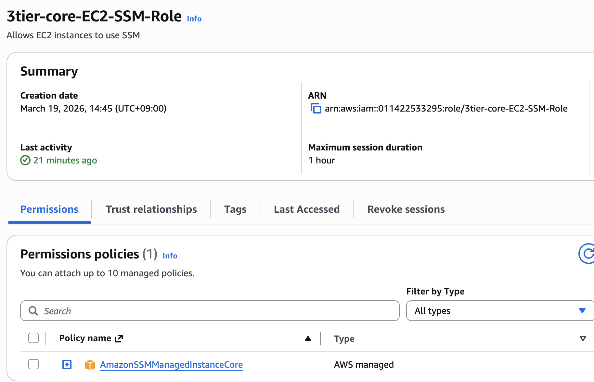
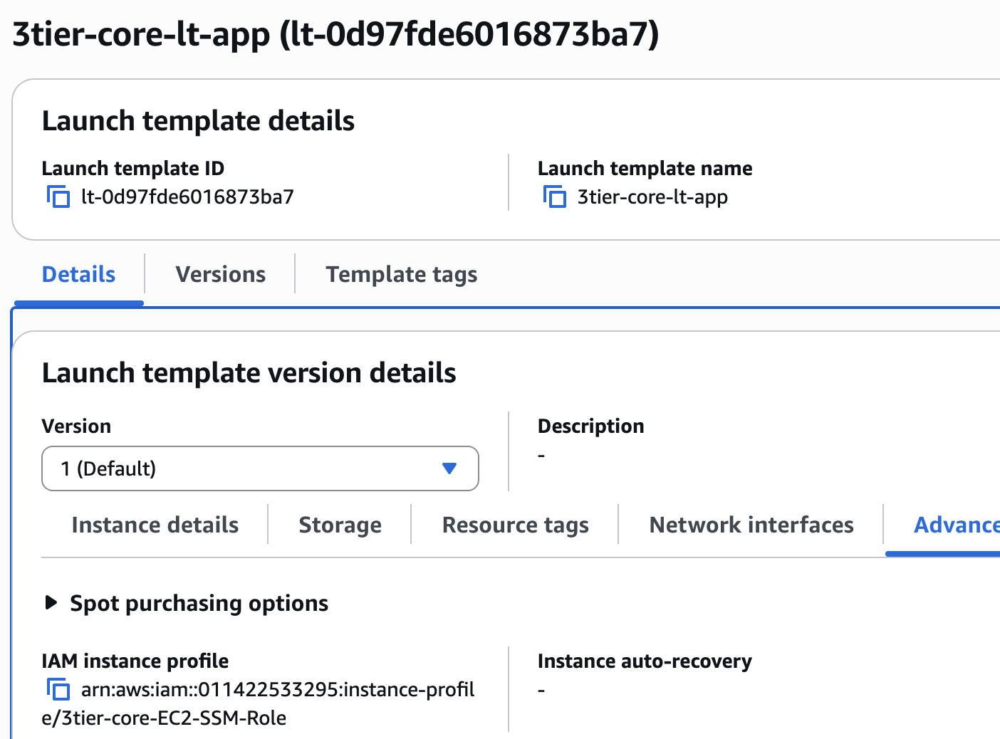
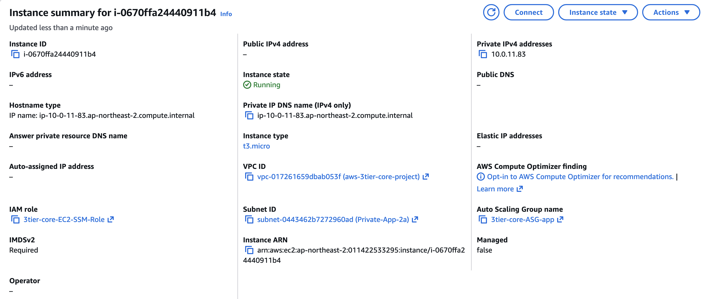
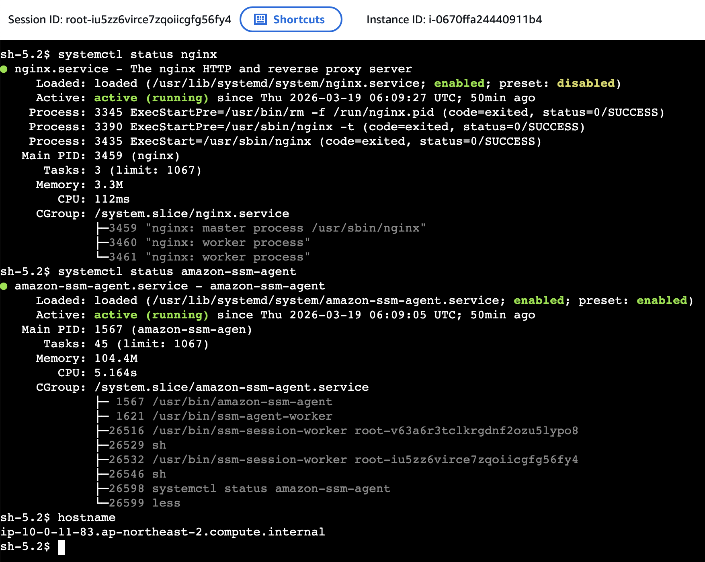
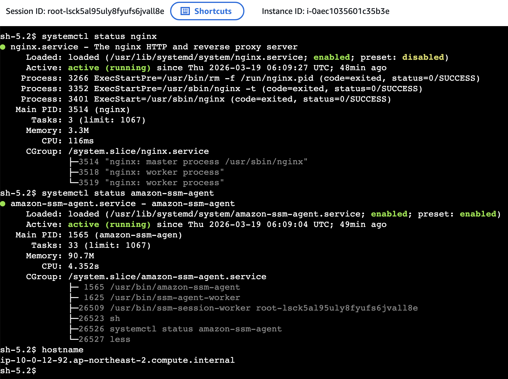
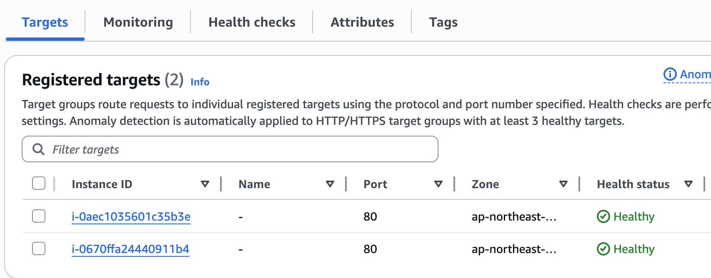
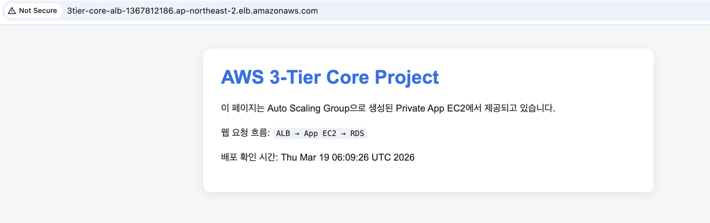

# IAM Role and SSM Session Manager

## 1. 개요

이번 단계에서는 기존 AWS 3-Tier Core 구조를 다시 구축한 뒤,  
**IAM Role** 과 **AWS Systems Manager Session Manager** 를 적용해  
Private App EC2에 안전하게 접속할 수 있도록 구성했다.

기존 AWS 리소스는 비용 관리를 위해 모두 삭제된 상태였기 때문에,  
이번 작업은 새로운 확장보다는 **기존 Core Build를 다시 올리고 운영 접근 방식을 개선한 단계**라고 볼 수 있다.

기준 문서:
- `docs/core-build.md`

---

## 2. 이번 단계에서 추가한 내용

이번 단계의 핵심은 아래 2가지다.

- EC2에 **IAM Role** 적용
- **Session Manager** 를 통해 Private App EC2 접속 가능하도록 구성

이를 통해 다음이 가능해졌다.

- SSH 22번 포트 없이 인스턴스 접속
- `.pem` 키 없이 운영 접근
- App EC2를 Private Subnet에 유지한 상태로 관리 가능

---

## 3. 적용한 구성

### IAM Role
App EC2가 AWS Systems Manager와 통신할 수 있도록 EC2용 IAM Role을 생성했다.

연결한 정책:
- `AmazonSSMManagedInstanceCore`

### Launch Template 반영
Auto Scaling Group이 생성하는 모든 App EC2에 동일하게 적용되도록  
IAM Role은 개별 인스턴스가 아니라 **Launch Template** 에 반영했다.

### 운영 접근 방식
SSH 접근이 아닌,
**Session Manager** 를 통해 Private App EC2에 직접 접속하는 방식으로 구성했다.

---

## 4. 왜 이렇게 구성했는가

기존 3-Tier 구조에서도 웹 서비스 자체는 동작할 수 있었지만, 
운영 접근 방식까지 고려하면 IAM Role + Session Manager 구성이 더 적절했다.

이 구성을 적용한 이유는 다음과 같다.

- App EC2를 외부에 노출하지 않아도 됨
- SSH 인바운드 규칙이 필요 없음
- 키 파일 관리가 필요 없음
- 운영 관점에서 더 실제 환경에 가까움

즉, 이번 단계는 아키텍처를 크게 바꾼 것이 아니라  
**기존 Core Build의 운영성과 보안성을 조금 더 개선한 작업**이다.

---

## 5. 검증 내용

### 검증 1 — Session Manager 접속 성공
Session Manager를 통해 Private App EC2에 정상적으로 접속할 수 있음을 확인했다.

### 검증 2 — amazon-ssm-agent 상태 확인
SSM Agent가 정상 실행 중인지 확인했다.

```bash
systemctl status amazon-ssm-agent
Active: active (running)
```

이를 통해 Systems Manager 기반 운영 접근이 가능한 상태임을 확인했다.

### 검증 3 — nginx 상태 확인
웹 서비스가 정상 실행 중인지 확인했다.

```bash
systemctl status nginx
Active: active (running)
```

즉, 운영 접속뿐 아니라 App 서버 자체도 정상 동작 중임을 확인했다.


### 검증 4 — hostname 확인
접속한 인스턴스의 hostname을 확인해 Private 내부 인스턴스임을 점검했다.

```bash
hostname
ip-10-0-11-83.ap-northeast-2.compute.internal
ip-10-0-12-92.ap-northeast-2.compute.internal
```

이 결과를 통해 해당 인스턴스가 퍼블릭 서버가 아니라  
내부 네트워크 기반의 Private EC2 인스턴스임을 확인할 수 있었다.


### 검증 5 — ALB 서비스 경로 확인
Target Group 헬스체크와 ALB DNS 접속을 통해  
서비스 경로도 정상 동작함을 확인했다.

---

## 6. 스크린샷

### IAM Role 생성 화면


### Launch Template에 IAM Instance Profile 반영


### EC2 인스턴스 상세 화면


### Session Manager 접속 및 상태 확인



### Target Group 헬스체크


### ALB DNS 접속 결과


---

## 7. 정리

이번 단계에서는 기존 3-Tier Core 구조를 다시 구축한 뒤,  
**IAM Role** 과 **Session Manager** 를 적용해  
Private App EC2에 SSH 없이 접근할 수 있도록 구성했다.

이를 통해 App Tier는 Private 상태를 유지하면서도  
운영자는 안전하게 인스턴스에 접속하고 관리할 수 있게 되었다.

즉, 이번 작업은 기존 Core Build에  
**운영 접근 방식 개선**을 추가한 단계라고 정리할 수 있다.