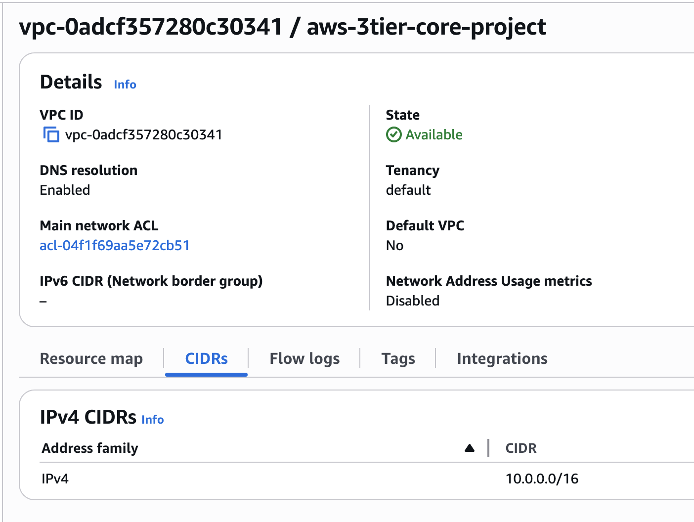
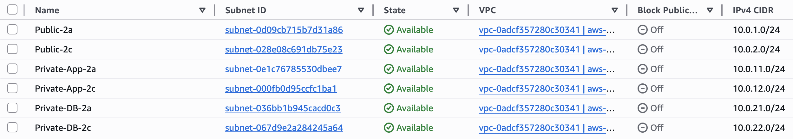
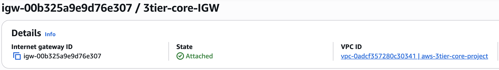
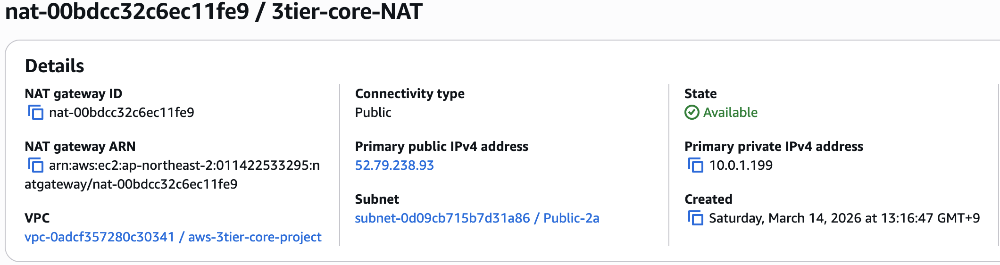

여기에 들어갈 내용:

## Step 1. VPC 생성
- VPC 이름: aws-3tier-core-project
- IPv4 CIDR: 10.0.0.0/16
- DNS resolution: Enabled

---

## Step 2. 서브넷 6개 생성
3-Tier 아키텍처 구성을 위해 아래와 같이 총 6개의 서브넷을 생성했다.

- Public-2a: 10.0.1.0/24
- Public-2c: 10.0.2.0/24
- Private-App-2a: 10.0.11.0/24
- Private-App-2c: 10.0.12.0/24
- Private-DB-2a: 10.0.21.0/24
- Private-DB-2c: 10.0.22.0/24

Public / App / DB 계층을 분리하고, 2개 AZ에 걸쳐 배치할 수 있도록 설계했다.

---
## Step 3. Internet Gateway 생성 및 VPC 연결
인터넷에서 ALB로 들어오는 트래픽을 처리할 수 있도록 Internet Gateway를 생성하고 VPC에 연결했다.

- IGW 이름: 3tier-core-IGW
- 연결 대상 VPC: aws-3tier-core-project
- 상태: Attached

---

## Step 4. NAT Gateway 생성
Private App Subnet의 EC2 인스턴스가 외부 인터넷으로 아웃바운드 통신을 할 수 있도록 NAT Gateway를 생성했다.

- NAT 이름: 3tier-core-NAT
- 배치 서브넷: Public-2a
- Connectivity type: Public
- Elastic IP 연결 완료
- 상태: Available

---

## Step 5. Route Table 연결
퍼블릭 프라이빗 네트워크를 분류하기 위해서 Route Table을 3개 생성하고, 각 Subnet을 목적에 맞는 Router에 연결하였다.

### 1) Public Route Table
- 목적: 인터넷과 직접 통신하는 퍼블릭 계층용
- 라우트:
  - `10.0.0.0/16 -> local`
  - `0.0.0.0/0 -> Internet Gateway`
- 연결 서브넷:
  - Public-2a
  - Public-2c

### 2) Private App Route Table
- 목적: 프라이빗 앱 EC2의 인터넷 통신용
- 라우트:
  - `10.0.0.0/16 -> local`
  - `0.0.0.0/0 -> NAT Gateway``
- 연결 서브넷:
  - Private-app-2a
  - Private-app-2c

### 03) Private DB Route Table
- 목적: DB 계층 격리용
- 라우트:
  - `10.0.0.0/16 -> local`
- 연결 서브넷:
  - Private-DB-2a
  - Private-DB-2c

---

- Security Group 생성
- RDS 생성
- Launch Template 생성
- Target Group 생성
- ALB 생성
- ASG 생성
- CloudWatch 알람 생성
- 테스트 진행

###
무엇을 만들었는지
어떤 값으로 만들었는지
왜 그렇게 했는지
체크 포인트가 무엇인지