# Launch Template 업데이트와 Instance Refresh

## 1. 개요

이번 단계에서는 기존 AWS 3-Tier Core 구조를 다시 구축한 뒤,  
**Launch Template 새 버전 생성**과 **Instance Refresh** 실습을 통해  
운영 중인 App EC2를 안전하게 교체하는 과정을 경험했다.

기존 AWS 리소스는 비용 관리를 위해 모두 삭제된 상태였기 때문에,  
이번 작업은 새로운 서비스 기능을 추가한 단계라기보다  
**기존 Core Build를 다시 올린 뒤 운영 변경 절차를 실습한 단계**라고 볼 수 있다.

기준 문서:
- `docs/core-build.md`
- `docs/iam-role-ssm-session-manager.md`

---

## 2. 이번 단계에서 진행한 내용

이번 단계의 핵심은 아래 3가지다.

- **Launch Template Version 2 생성**
- **Auto Scaling Group에 새 버전 반영**
- **Instance Refresh를 통한 기존 인스턴스 교체**

이를 통해 다음을 실습할 수 있었다.

- Launch Template 버전 관리
- 운영 중인 App 인스턴스 교체 방식 이해
- 변경 후 실제 서비스 상태 검증 경험

---

## 3. 적용한 구성

### Launch Template 버전 생성
기존 App EC2용 Launch Template를 기반으로  
새 버전인 **Version 2**를 생성했다.

이번 변경에서는 큰 구조 변경보다  
**user data와 웹 페이지 문구 수정**을 예시로 사용했다.

즉, 인프라 구조 자체를 바꾸기보다  
**운영 중인 인스턴스를 새 설정으로 교체하는 흐름**을 확인하는 데 집중했다.

### Auto Scaling Group 반영
Auto Scaling Group이 이후 생성하는 App EC2가  
새 Launch Template 버전을 사용하도록 설정했다.

즉, 새 인스턴스는 모두 **Version 2 기준**으로 생성되도록 구성했다.

### Instance Refresh 실행
기존에 실행 중이던 App EC2를  
새 Launch Template 버전 기준으로 순차 교체하기 위해  
**Instance Refresh**를 실행했다.

이를 통해 서비스는 유지하면서  
기존 인스턴스를 새 버전으로 교체하는 과정을 실습했다.

---

## 4. 왜 이렇게 구성했는가

기존 3-Tier Core 구조에서도 웹 서비스 자체는 동작할 수 있었지만,  
운영 관점에서는 **인프라 변경을 안전하게 반영하는 경험**이 필요했다.

이번 구성을 적용한 이유는 다음과 같다.

- Launch Template 변경 이력을 버전 단위로 관리할 수 있음
- Auto Scaling Group 환경에서 인스턴스 교체를 수동으로 하지 않아도 됨
- 운영 중인 서비스에 변경을 반영하는 절차를 학습할 수 있음
- 변경 후 검증까지 포함한 운영 경험을 포트폴리오에 담을 수 있음

즉, 이번 단계는 아키텍처를 크게 확장한 것이 아니라  
**기존 Core Build에 운영 변경 경험을 추가한 작업**이다.

---

## 5. 진행 과정

### 1) Core 환경 재구성
비용 관리를 위해 AWS 리소스를 모두 삭제한 상태였기 때문에,  
먼저 `core-build.md` 기준으로 기존 3-Tier 환경을 다시 구성했다.

기본 확인 항목:
- ALB 정상 동작
- ASG 인스턴스 2대 정상 실행
- Target Group 헬스체크 통과
- ALB DNS로 웹 페이지 접속 가능

### 2) Launch Template Version 2 생성
기존 Launch Template를 수정해 새 버전을 생성했다.

주요 변경 내용:
- user data 수정
- 웹 페이지 문구 변경

이번 실습에서는  
변경 결과를 쉽게 확인할 수 있도록  
웹 페이지에 **Version 2 배너 문구**가 보이도록 구성했다.

### 3) ASG에 Version 2 반영
Auto Scaling Group이 새 Launch Template 버전을 사용하도록 수정했다.

즉, 이후 생성되는 인스턴스는  
모두 **Launch Template Version 2** 기준으로 생성되도록 설정했다.

### 4) Instance Refresh 실행
기존 인스턴스를 새 버전 기준으로 교체하기 위해  
AWS Console에서 Instance Refresh를 실행했다.

사용한 주요 설정:
- Minimum healthy percentage: `100`
- Instance warmup: `300`
- Skip matching: `enabled`
- Checkpoint: `50%`

---

## 6. 진행 중 발생한 이슈

첫 번째 Instance Refresh는 **Successful**로 끝났지만,  
실제 결과는 완전히 정상적이지 않았다.

### 발생한 현상
- App EC2 1대는 **Launch Template Version 2**
- 나머지 1대는 **Launch Template Version 1**
- ALB DNS에 접속해 새로고침하면
  - 기존 HTML
  - 수정된 HTML
  이 번갈아 출력됨

즉, refresh는 성공으로 표시됐지만  
실제 서비스 인스턴스는 **구버전과 신버전이 함께 동작하는 상태**였다.

**Desired configuration을 명시하지 않은 상태**였기 때문/lauchtemplate/ 시작 시점의 비교 기준으로 교체 대상을 판단한 것으로 보인다.

이 상태에서 **Skip matching**이 켜져 있었기 때문에  
해당 인스턴스가 교체 대상에서 제외되었을 가능성이 높았다.

### 해결
두 번째 Instance Refresh에서는  
**Desired configuration에 Launch Template Version 2를 명시**한 뒤 다시 실행했다.

이후에는 Version 1 인스턴스가 교체 대상으로 인식되어  
정상적으로 교체가 진행되는 것을 확인했다.

즉, 이번 이슈를 통해  
**Instance Refresh의 성공 상태만 보는 것이 아니라  
실제 인스턴스 버전과 서비스 응답까지 확인해야 한다는 점**을 배웠다.

---

## 7. 스크린샷

### Launch Template Version 2 생성 화면
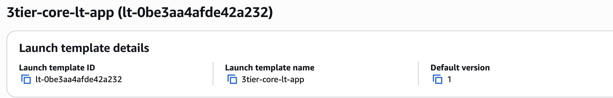
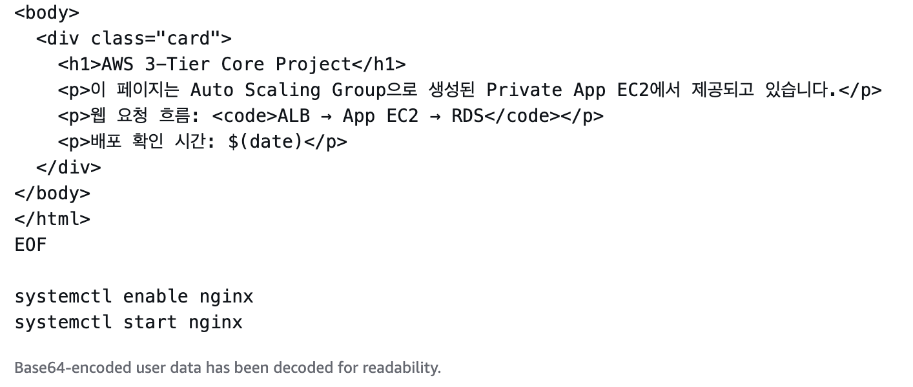
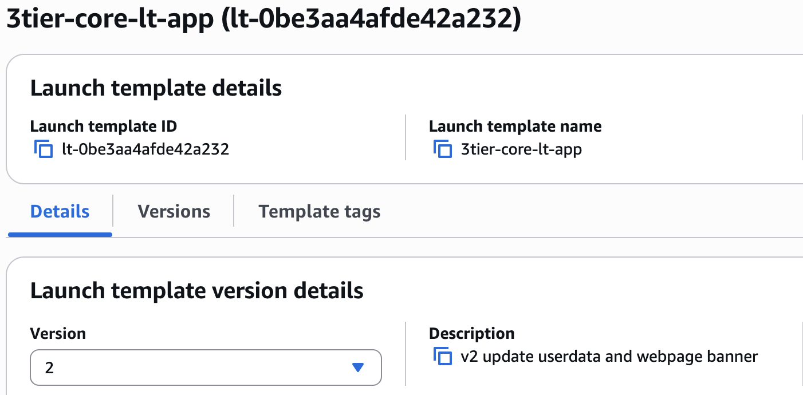
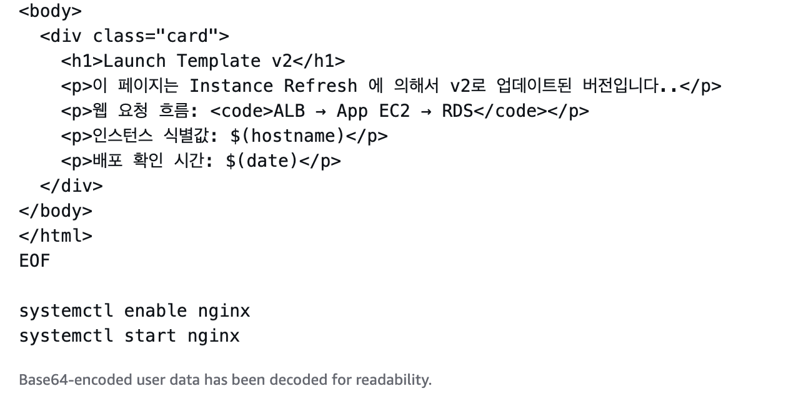

### ASG에 Version 2 반영
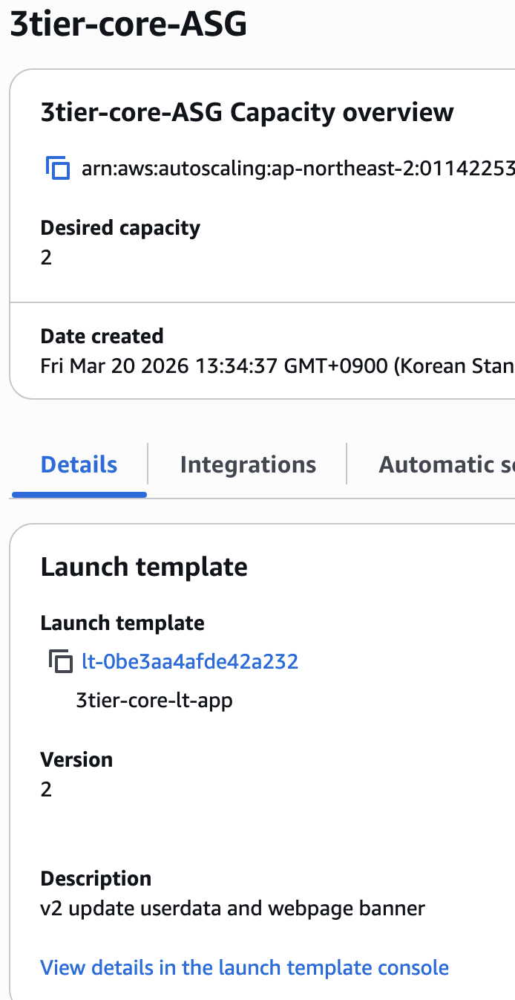

### 첫 번째 Instance Refresh
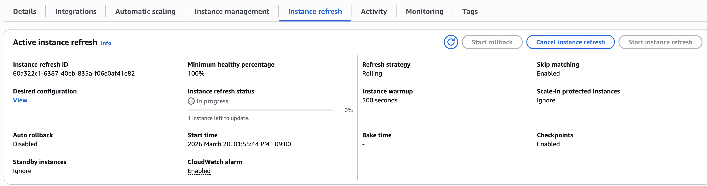

### 이후 v1 / v2 혼합 상태
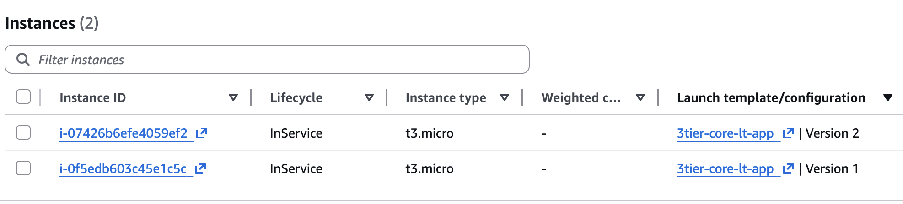

### Terminate Protection 확인
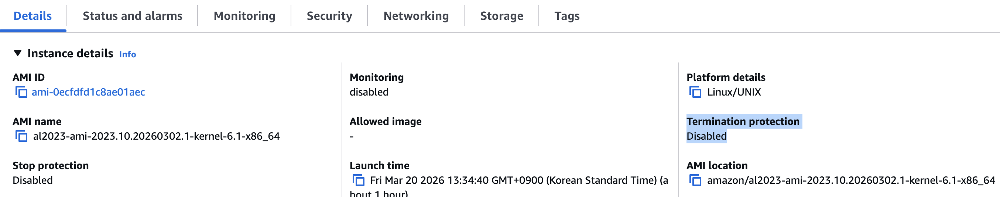

### Desired configuration 명시 화면

### 두 번째 refresh에서 v1 인스턴스 교체 진행
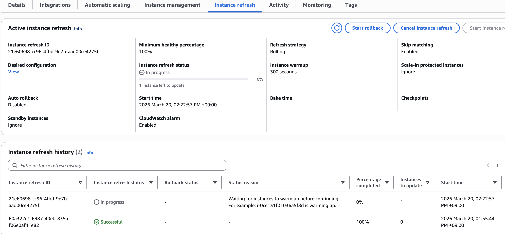

### 인스턴스 버전 확인
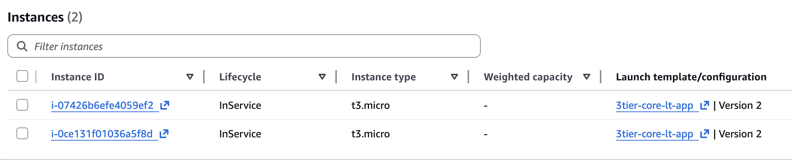

### Target Group 헬스체크
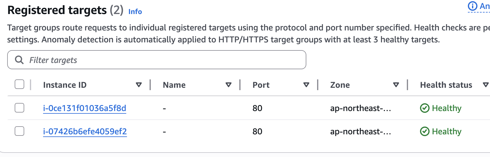

### ALB DNS 최종 확인
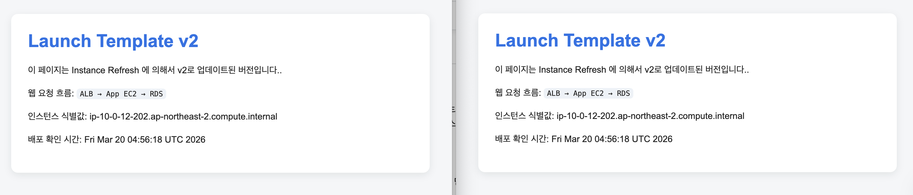

---

## 8. 정리

이번 단계에서는 기존 3-Tier Core 구조를 다시 구축한 뒤,  
**Launch Template 버전 관리**와 **Instance Refresh**를 적용해  
운영 중인 App EC2를 새 설정 기준으로 교체하는 과정을 실습했다.

이 과정에서:
- Launch Template Version 2 생성
- ASG에 새 버전 반영
- Instance Refresh 실행
- mixed-version 상태 확인
- Desired configuration 명시 후 재실행

까지 직접 경험할 수 있었다.

즉, 이번 작업은 기존 Core Build에  
**운영 중 인프라 변경 및 검증 경험**을 추가한 단계라고 정리할 수 있다.